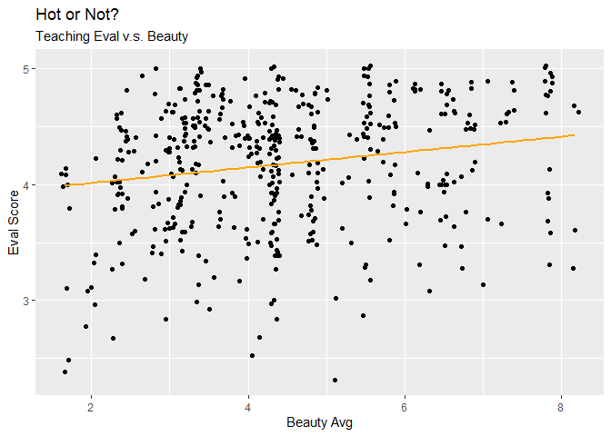

Lab 09 - Grading the professor, Pt. 1
================
Hannah Crawley
3/6/25

## Load Packages and Data

``` r
library(tidyverse) 
library(tidymodels)
```

    ## Warning: package 'tidymodels' was built under R version 4.4.3

    ## Warning: package 'dials' was built under R version 4.4.3

    ## Warning: package 'infer' was built under R version 4.4.3

    ## Warning: package 'modeldata' was built under R version 4.4.3

    ## Warning: package 'parsnip' was built under R version 4.4.3

    ## Warning: package 'recipes' was built under R version 4.4.3

    ## Warning: package 'rsample' was built under R version 4.4.3

    ## Warning: package 'tune' was built under R version 4.4.3

    ## Warning: package 'workflows' was built under R version 4.4.3

    ## Warning: package 'workflowsets' was built under R version 4.4.3

    ## Warning: package 'yardstick' was built under R version 4.4.3

``` r
library(openintro)
```

    ## Warning: package 'openintro' was built under R version 4.4.3

    ## Warning: package 'airports' was built under R version 4.4.3

    ## Warning: package 'cherryblossom' was built under R version 4.4.3

    ## Warning: package 'usdata' was built under R version 4.4.3

``` r
evals
```

    ## # A tibble: 463 × 23
    ##    course_id prof_id score rank    ethnicity gender language   age cls_perc_eval
    ##        <int>   <int> <dbl> <fct>   <fct>     <fct>  <fct>    <int>         <dbl>
    ##  1         1       1   4.7 tenure… minority  female english     36          55.8
    ##  2         2       1   4.1 tenure… minority  female english     36          68.8
    ##  3         3       1   3.9 tenure… minority  female english     36          60.8
    ##  4         4       1   4.8 tenure… minority  female english     36          62.6
    ##  5         5       2   4.6 tenured not mino… male   english     59          85  
    ##  6         6       2   4.3 tenured not mino… male   english     59          87.5
    ##  7         7       2   2.8 tenured not mino… male   english     59          88.6
    ##  8         8       3   4.1 tenured not mino… male   english     51         100  
    ##  9         9       3   3.4 tenured not mino… male   english     51          56.9
    ## 10        10       4   4.5 tenured not mino… female english     40          87.0
    ## # ℹ 453 more rows
    ## # ℹ 14 more variables: cls_did_eval <int>, cls_students <int>, cls_level <fct>,
    ## #   cls_profs <fct>, cls_credits <fct>, bty_f1lower <int>, bty_f1upper <int>,
    ## #   bty_f2upper <int>, bty_m1lower <int>, bty_m1upper <int>, bty_m2upper <int>,
    ## #   bty_avg <dbl>, pic_outfit <fct>, pic_color <fct>

# Part 1: Exploratory Data Analysis

## Exercise 1

> Visualize the distribution of score. Is the distribution skewed? What
> does that tell you about how students rate courses? Is this what you
> expected to see? Why, or why not? Include any summary statistics and
> visualizations you use in your response.

``` r
ggplot(evals, aes(x = score)) +
  geom_histogram()
```

    ## `stat_bin()` using `bins = 30`. Pick better value with `binwidth`.

<!-- -->

``` r
ggplot(evals, aes(x = score)) +
  geom_boxplot()
```

<!-- -->

``` r
summary(evals$score)
```

    ##    Min. 1st Qu.  Median    Mean 3rd Qu.    Max. 
    ##   2.300   3.800   4.300   4.175   4.600   5.000

- Distribution is skewed left meaning that many students are rating
  courses positively  
- I would expect ratings to be more evenly distributed or perhaps even
  negative since most students who do reviews are complaining

``` r
# Add your R code here
```

## Exercise 2

> Visualize and describe the relationship between score and the variable
> bty_avg, a professor’s average beauty rating. See the help page for
> the function at <http://ggplot2.tidyverse.org/reference/index.html>.

``` r
ggplot(evals, aes(x = score, y = bty_avg)) +
  geom_point()
```

<!-- -->

- Relationship between beauty and score of professor is slightly
  positive

## Exercise 3

> Replot the scatterplot from Exercise 3, but this time use
> geom_jitter()? What does “jitter” mean? What was misleading about the
> initial scatterplot?

``` r
ggplot(evals, aes(x = score, y = bty_avg)) +
  geom_jitter()
```

<!-- --> - Jitter adds a
small amount of random variation to each point making it easier to see
points that potentially overlap  
- this spreads out the points to and makes the distribution look like
there is less of a relationship, but still shows skew  
- the first plot is slightly misleading due to the overlap in points

# Part 2: Linear Regression with a Numerical Predictor

## Exercise 4

> Let’s see if the apparent trend in the plot is something more than
> natural variation. Fit a linear model called m_bty to predict average
> professor evaluation score by average beauty rating (bty_avg). Based
> on the regression output, write the linear model.

``` r
m_bty <- linear_reg() %>%
  set_engine("lm") %>%
  fit(score ~ bty_avg, data = evals)
```

``` r
summary(m_bty$fit)
```

    ## 
    ## Call:
    ## stats::lm(formula = score ~ bty_avg, data = data)
    ## 
    ## Residuals:
    ##     Min      1Q  Median      3Q     Max 
    ## -1.9246 -0.3690  0.1420  0.3977  0.9309 
    ## 
    ## Coefficients:
    ##             Estimate Std. Error t value Pr(>|t|)    
    ## (Intercept)  3.88034    0.07614   50.96  < 2e-16 ***
    ## bty_avg      0.06664    0.01629    4.09 5.08e-05 ***
    ## ---
    ## Signif. codes:  0 '***' 0.001 '**' 0.01 '*' 0.05 '.' 0.1 ' ' 1
    ## 
    ## Residual standard error: 0.5348 on 461 degrees of freedom
    ## Multiple R-squared:  0.03502,    Adjusted R-squared:  0.03293 
    ## F-statistic: 16.73 on 1 and 461 DF,  p-value: 5.083e-05

score(y^) = 3.88 + 0.067(bty_avg)

## Exercise 5

> Replot your visualization from Exercise 3, and add the regression line
> to this plot in orange color. Turn off the shading for the uncertainty
> of the line.

``` r
ggplot(evals, aes(x = bty_avg, y = score)) +
  geom_jitter() + 
  geom_smooth(method = "lm", color = "orange", se = FALSE) + 
  labs(title = "Hot or Not?", subtitle = "Teaching Eval v.s. Beauty", x = "Beauty Avg", y = "Eval Score" )
```

    ## `geom_smooth()` using formula = 'y ~ x'

<!-- -->

## Exercise 6

> Interpret the slope of the linear model in context of the data.

Formula: score(y^) = 3.88 + 0.067(bty_avg)

- Slope: for each additional point of beauty average teaching evaluation
  score is expected to be 0.067 higher on average

## Exercise 7

> Interpret the intercept of the linear model in context of the data.
> Comment on whether or not the intercept makes sense in this context.

- Intercept: For a beauty average of 0 the teaching eval score is
  expected to be 3.88 – this intercept does not particularly make since
  in our context based on the scale presented … and that the teachers
  can’t be that horrible looking… someone “don’t yuck someone else’s
  yum” i guess…

## Exercise 8

> Determine the R^2 of the model and interpret it in context of the
> data.

``` r
summary(m_bty$fit)$r.squared
```

    ## [1] 0.03502226

- R^2 = 0.03502 – 3.5% of the variance in the teaching eval score can be
  explained by avg beauty, not a whole lot

# Part 3: Linear Regression with a Categorical Predictor

## Exercise 9

> Fit a new linear model called m_gen to predict average professor
> evaluation score based on gender of the professor. Based on the
> regression output, write the linear model and interpret the slope and
> intercept in context of the data.

## Exercise 10

> What is the equation of the line corresponding to male professors?
> What is it for female professors?

## Exercise 11

> Fit a new linear model called m_rank to predict average professor
> evaluation score based on rank of the professor. Based on the
> regression output, write the linear model and interpret the slopes and
> intercept in context of the data.

## Exercise 12

> For Exercise 12, the `relevel()` function can be helpful!Create a new
> variable called rank_relevel where “tenure track” is the baseline
> level.

## Exercise 13

> Fit a new linear model called m_rank_relevel to predict average
> professor evaluation score based on rank_relevel of the professor.
> This is the new (releveled) variable you created in Exercise 13. Based
> on the regression output, write the linear model and interpret the
> slopes and intercept in context of the data. Also determine and
> interpret the R^2 of the model.

## Exercise 14

> Create another new variable called tenure_eligible that labels
> “teaching” faculty as “no” and labels “tenure track” and “tenured”
> faculty as “yes”.

## Exercise 15

> Fit a new linear model called m_tenure_eligible to predict average
> professor evaluation score based on tenure_eligibleness of the
> professor. This is the new (regrouped) variable you created in
> Exercise 15. Based on the regression output, write the linear model
> and interpret the slopes and intercept in context of the data. Also
> determine and interpret the R^2 of the model.
